# PhiVision v2.0: Technical Implementation Brief

> [!NOTE]
> **Context for AI Agent**: You are tasked with optimizing, debugging, or extending the **PhiVision** module in the Axora Electron application. This document provides the strict technical context, file map, and architectural constraints you must respect.

## 1. Architecture & Data Flow

**Pattern**: `Capture` (Main) -> `Analysis` (Renderer/Cloud) -> `Enrichment` (Main/Agent Loop).

```mermaid
sequenceDiagram
    participant Renderer as 🖥️ Renderer (UI)
    participant Main as ⚙️ Main (Orchestrator)
    participant Cloud as ☁️ API (Mistral/Supabase)

    Note over Renderer: 1. Trigger
    Renderer->>Main: IPC `PHIVISION.TRIGGER`
    Main-->>Renderer: IPC `PHIVISION.RESULT` (Base64)

    Note over Renderer: 2. Analysis
    Renderer->>Cloud: POST /chat/completions (OCR Schema)
    Cloud-->>Renderer: JSON { "dispensation_lines": [...], "patient": ... }

    Note over Renderer, Main: 3. Enrichment (The Optimization Target)
    Renderer->>Main: IPC `PHIVISION.ENRICH` (Parsed JSON)
    activate Main
    Main->>Main: EnrichmentOrchestrator.runEnrichment()

    par Parallel Agent Execution (Optimized Target)
        Main->>Cloud: Agent: DCIResolver
        Main->>Cloud: Agent: PharmaAnalyzer
    and
        Main->>Cloud: Agent: ContextDeductor
        Main->>Cloud: Agent: OpportunityScout
    end

    Main-->>Renderer: IPC `PHIVISION.ENRICH_RESULT` (Full JSON)
    deactivate Main
```



## 2. Codebase Map (Critical Paths)

| Component        | Absolute Path                                                        | Responsibility                                                              |
| :--------------- | :------------------------------------------------------------------- | :-------------------------------------------------------------------------- |
| **Orchestrator** | `/src/main/services/phivision/enrichment/EnrichmentOrchestrator.ts`  | Main entry point. Sequentially runs agents. **Target for parallelization.** |
| **Interface**    | `/src/main/services/phivision/enrichment/IEnrichmentAgent.ts`        | Base class for all agents. Defines `enrich()`.                              |
| **Types**        | `/src/main/services/phivision/enrichment/types/enrichmentTypes.ts`   | Zod-aligned interfaces for outputs.                                         |
| **Agent 1**      | `/src/main/services/phivision/enrichment/agents/DCIResolver.ts`      | Normalizes drug names. Heavy prompt logic.                                  |
| **Agent 2**      | `/src/main/services/phivision/enrichment/agents/PharmaAnalyzer.ts`   | Clinical safety checks. Uses `mistral-large`.                               |
| **Agent 3**      | `/src/main/services/phivision/enrichment/agents/ContextDeductor.ts`  | Infers patient pathology.                                                   |
| **Agent 4**      | `/src/main/services/phivision/enrichment/agents/OpportunityScout.ts` | Cross-selling. **incomplete logic** (missing vector search).                |
| **Service**      | `/src/main/services/phivision/core/PhiVisionService.ts`              | Wires Capture, OCR, and Enrichment together.                                |

## 3. Current Implementation Status & Flaws

### 3.1 Orchestration Performance

- **Current**: Agents run **sequentially** (`await agent.enrich()` inside a `for` loop).
- **Flaw**: Total latency = Sum(Agent1 + Agent2 + ...). Can take 10-15s.
- **Optimization**: Move to `Promise.allSettled()` for independent agents to reduce latency to Max(Agent_Time).

### 3.2 IPC Data Payload

- **Current**: `PHIVISION.RESULT` passes a full resolution Raw Base64 image string.
- **Flaw**: High memory usage, UI freeze on large displays.
- **Optimization**: Compress image in Main process _before_ sending to Renderer, or save to disk/temp and pass file path.

### 3.3 "Hybrid Catalog" Gap (OpportunityScout)

- **Current**: `OpportunityScout.ts` relies 100% on LLM hallucinations for product suggestions ("Probionov", "Lactibiane").
- **Target**: Implement **RAG / Vector Search**.
  - _Requirement_: The agent should query a local Vector Store (or Supabase `pgvector`) to find _actual_ products in stock matching the LLM's intent.
  - _Missing_: No connection to `ProductService` or `VectorService` in `OpportunityScout.ts`.

## 4. Agent Interfaces (Type Definitions)

Your implementation must strictly adhere to these IO contracts.

```typescript
// Input for ALL Agents
export interface FacturationScreenV2 {
  dispensation_lines: { designation: string; quantity: number }[];
  patient?: { age_years: number; gender: string };
  prescriber?: { specialty: string };
  // ...
}

// Output Wrapper
export interface EnrichmentAgentResult {
  agentName: string;
  success: boolean;
  data: any; // Checked against specific Agent Types
  processingTimeMs: number;
  error?: string;
}
```

## 5. Optimization Directives for You (The Agent)

1.  **Refactor Orchestrator**: Change `EnrichmentOrchestrator.ts` to execute agents in parallel where possible.
2.  **Enhance Connectors**: Inject a `CatalogService` into `OpportunityScout` to validate AI suggestions against real inventory.
3.  **Strict Typing**: Ensure all LLM JSON outputs are parsed with `Zod` schemas (currently using `JSON.parse` with loose casting).
4.  **Error Handling**: If `PharmaAnalyzer` fails (critical), the whole pipeline must not crash, but `enrichment.status` should reflect 'partial_error'.

Use this brief as your "Spec Sheet" for any code modifications.
